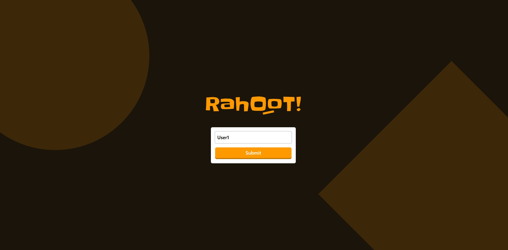
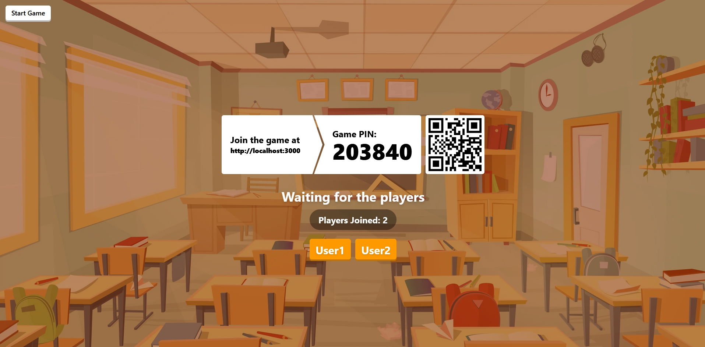
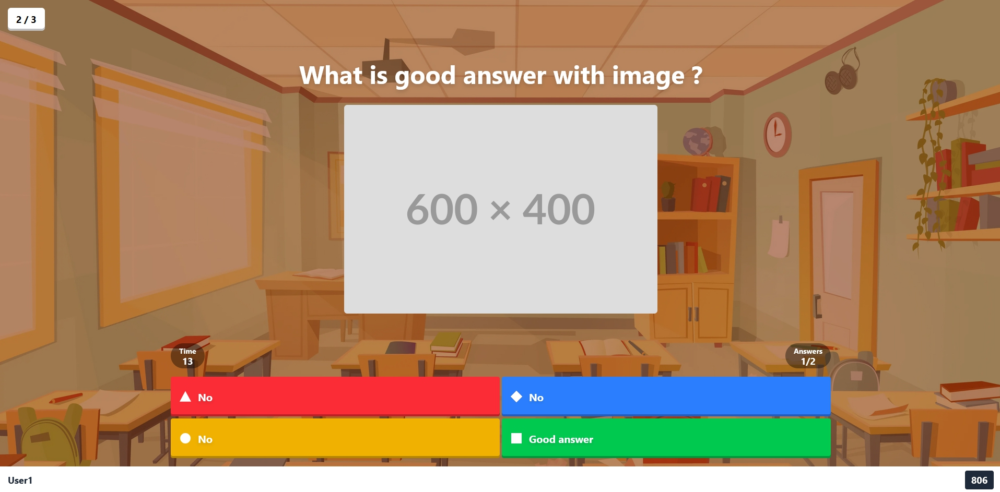

<p align="center">
  
  <br><br>
  
  
  
</p>

---

## 🧩 C'est quoi LTNHoot ?

**LTNHoot** est un fork amélioré de [Rahoot](https://github.com/Ralex91/Rahoot), une plateforme de quiz open-source auto-hébergée inspirée de Kahoot.

Par rapport au projet original, LTNHoot apporte :

- 🎨 **Interface Manager redessinée** — dashboard plein écran avec sidebar dossiers/tags, grille de cartes quiz et sélection visuelle
- 🏆 **Podium & classement animés** — animations multi-phases style Kahoot
- 🧑‍🤝‍🧑 **Générateur d'avatars** — identité visuelle unique pour chaque joueur
- 📂 **Gestion de dossiers** — organise tes quiz par catégorie
- 🖼️ **Upload d'images** — ajoute des médias directement depuis le manager
- 🌐 **Multilingue** — interface disponible en plusieurs langues
- 🃏 **Nouveaux types de questions** — `drop_pin`, `puzzle`, `slider`, `date`, `open`

<p align="center">
  
  
  
</p>

---

## ⚙️ Prérequis

| Méthode | Outils nécessaires |
|---|---|
| **Docker** (recommandé) | Docker + Docker Compose |
| **Sans Docker** | Node.js 22+ et pnpm |

---

## 🚀 Démarrage rapide

### 🐳 Avec Docker (recommandé)

```bash
# Récupérer le compose.yml et démarrer
docker compose up -d
```

L'application est disponible sur **http://localhost:3000**

Le dossier `config/` est créé automatiquement au premier démarrage avec un quiz d'exemple.

Pour mettre à jour vers la dernière version :

```bash
docker compose pull && docker compose up -d
```

---

### 🛠️ Sans Docker

```bash
# Cloner le dépôt
git clone https://github.com/gyrese/LTHhoot.git
cd LTHhoot

# Installer les dépendances
pnpm install

# Mode développement
pnpm dev

# Mode production
pnpm build && pnpm start
```

---

## ⚙️ Configuration

### `config/game.json` — Paramètres généraux

```json
{
  "managerPassword": "MON_MOT_DE_PASSE"
}
```

> ⚠️ Change le mot de passe par défaut `"PASSWORD"`, sinon l'accès au manager est bloqué.

---

### `config/quizz/*.json` — Structure d'un quiz

Les quiz peuvent être créés via **l'éditeur intégré** dans le manager (recommandé) ou manuellement en JSON.

```json
{
  "subject": "Mon Quiz",
  "questions": [
    {
      "question": "Quelle est la bonne réponse ?",
      "answers": ["Non", "Oui", "Non", "Non"],
      "solutions": [1],
      "cooldown": 5,
      "time": 15
    },
    {
      "question": "Quelles sont les couleurs primaires ?",
      "answers": ["Rouge", "Vert", "Bleu", "Jaune"],
      "solutions": [0, 2, 3],
      "cooldown": 5,
      "time": 20
    },
    {
      "question": "Question avec image",
      "answers": ["Non", "Oui", "Non", "Non"],
      "media": {
        "type": "image",
        "url": "https://example.com/image.png"
      },
      "solutions": [1],
      "cooldown": 5,
      "time": 20
    }
  ]
}
```

| Champ | Description |
|---|---|
| `subject` | Titre du quiz |
| `question` | Texte de la question |
| `answers` | Tableau de 2 à 4 réponses possibles |
| `solutions` | Indices des bonnes réponses (base 0, plusieurs possibles) |
| `media` | Optionnel — `type`: `image` / `video` / `audio`, `url`: lien du média |
| `cooldown` | Délai avant affichage des résultats (3–15 s) |
| `time` | Temps de réponse accordé (5–120 s) |

---

## 🎮 Comment jouer

1. Ouvre le manager sur **http://localhost:3000/manager**
2. Entre le mot de passe défini dans `config/game.json`
3. Sélectionne un quiz dans le dashboard
4. Partage l'URL **http://localhost:3000** et le code de partie aux joueurs
5. Attends que les joueurs rejoignent, puis lance la partie

---

## 🏗️ Architecture

```
LTNHoot/
├── packages/
│   ├── common/      # Types et utilitaires partagés
│   ├── web/         # Frontend React (Vite)
│   └── socket/      # Backend Node.js (Socket.IO)
├── docker/
│   ├── nginx.conf       # Reverse proxy nginx
│   └── supervisord.conf # Gestionnaire de processus
├── config/          # Données persistantes (quiz, settings)
├── Dockerfile       # Build multi-stage
└── compose.yml      # Déploiement Docker
```

---

## 🤝 Contribuer

Les contributions sont les bienvenues. Consulte le guide [CONTRIBUTING.md](.github/CONTRIBUTING.md) avant de soumettre une PR.

Pour signaler un bug ou proposer une fonctionnalité, [ouvre une issue](https://github.com/gyrese/LTHhoot/issues).

---

*Fork de [Rahoot](https://github.com/Ralex91/Rahoot) par Ralex91 — licence MIT*
